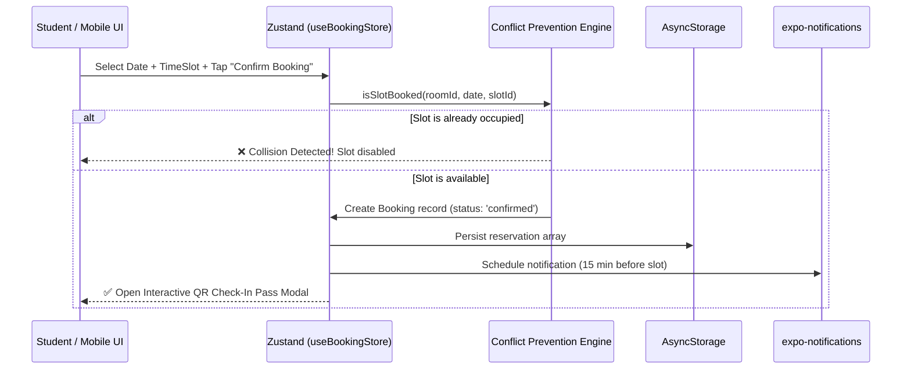

# MINI-PROJECT SHORT TECHNICAL REPORT
**Course:** Cross-Platform Mobile App Development (VKU)  
**Mini-Project Title:** Mini-Project 2 — Real-time Study Room Booking App (React Native & Expo)  
**Institution:** Faculty of Computer Science, Vietnam - Korea University of Information and Communication Technology (VKU)  
**Instructor:** Nguyen Thanh Tuan, PhD  
**Submission Date:** 17/09/2026  

---

## 1. GENERAL INFORMATION & DELIVERABLE LINKS
* **Student Information (Individual Project):**
  * **Full Name:** **Dương Bảo Đạt**
  * **Student ID:** **23IT046**
  * **Class / Cohort:** **23SE1** — Faculty of Computer Science
  * **Role:** **Full-Stack Mobile Developer (Architecture, UI/UX Design, State Management, Conflict Engine & Notifications)**
  * **Contribution:** **100%**
* **🔗 Live Demo URL:** [https://vku-study-room-booking.pages.dev](https://vku-study-room-booking.pages.dev) *(Hosted on Cloudflare Pages)*
* **💻 GitHub Repository:** [https://github.com/duongdatdev/vku-study-room-booking](https://github.com/duongdatdev/vku-study-room-booking)

---

## 2. FEATURE IMPLEMENTATION CHECKLIST

| # | Required Feature | Status | Implementation Details & Acceptance Level |
|:---:|---|:---:|---|
| **1** | **Room Discovery & Multi-Parameter Filter** | ✅ Complete | 21+ mock study rooms & computer labs across VKU buildings (Khu KA, Khu KB, Khu KC, Khu VA). Instant controlled keyword search and dynamic filter chips by building, capacity threshold, and equipment (High-spec PC, Projector, Whiteboard, AC). |
| **2** | **60fps FlatList List Optimization** | ✅ Complete | Memoized `RoomCard` components with `React.memo`, `initialNumToRender={10}`, `maxToRenderPerBatch={5}`, `windowSize={5}`, and `removeClippedSubviews={true}` ensuring smooth 60fps scrolling without frame drops. |
| **3** | **Interactive Time-Slot Selector & Conflict Engine** | ✅ Complete | 7-day horizontal calendar picker combined with 2-hour discrete time slots (`07:30–09:30`, `09:30–11:30`, `13:00–15:00`, etc.). Visual conflict prevention: already-booked slots are grayed-out, strikethrough, and disabled in real time. |
| **4** | **Interactive QR Check-In Modal & Boarding Pass** | ✅ Complete | Generates a unique booking pass with an interactive QR code using `react-native-qrcode-svg`. Provides a simulated door-lock check-in trigger updating reservation status to `CHECKED IN`. |
| **5** | **Global State Management with Zustand & Persistence** | ✅ Complete | Single-source-of-truth `useBookingStore` managing user session, bookings, conflict checks, and filters. Persisted across app restarts via `@react-native-async-storage/async-storage`. |
| **6** | **Local Notifications Reminders** | ✅ Complete | Integrated `expo-notifications` with custom `useNotifications` hook to schedule local alert reminders 15 minutes prior to booking start time. Includes an instant test notification trigger on the Profile screen. |
| **7** | **Responsive Design & Custom Hook (Slide 26-27)** | ✅ Complete | Implemented `useResponsiveLayout` using `useWindowDimensions()` to dynamically recalculate columns (`numColumns={columns}`, `key={columns}`) and card widths across portrait, landscape, and tablet viewports. |
| **8** | **TanStack Query, Pull-to-Refresh & Motion** | ✅ Complete | The room feed is cached for five minutes through TanStack Query and refreshes via native FlatList pull-to-refresh. Reanimated staggered card entry respects the device reduced-motion preference. Current query data is local mock data behind a replaceable service boundary. |

---

## 3. TECHNICAL ARCHITECTURE & PROJECT STRUCTURE

### 3.1 Directory Structure
```
Mini-Project-2/
├── assets/                       # App icons, splash screens
├── src/
│   ├── types/index.ts            # Strict TypeScript interfaces for Room, Booking, FilterState
│   ├── data/
│   │   ├── mockRooms.ts          # 21 realistic VKU study rooms & computer labs
│   │   └── timeSlots.ts          # 2-hour discrete slots & 7-day generator
│   ├── store/useBookingStore.ts  # Zustand store + AsyncStorage + Conflict Engine
│   ├── hooks/
│   │   ├── useResponsiveLayout.ts# Slide 26-27 responsive columns & dimensions
│   │   └── useNotifications.ts   # expo-notifications 15-min reminder scheduler
│   ├── components/
│   │   ├── RoomCard.tsx          # Memoized room card with badges (Slide 14, 15)
│   │   ├── SearchBar.tsx         # Controlled search input (Slide 18)
│   │   ├── FilterChips.tsx       # Building, capacity & equipment chips
│   │   ├── TimeSlotPicker.tsx    # 7-day strip + 2h slot conflict selector
│   │   ├── BookingPassModal.tsx  # Boarding pass with QR Code & check-in
│   │   └── StatusBadge.tsx       # Real-time Available vs Occupied badge
│   ├── screens/
│   │   ├── BrowseRoomsScreen.tsx # 60fps FlatList room discovery (Slide 17, 29)
│   │   ├── RoomDetailScreen.tsx  # Reservation flow with conflict prevention
│   │   ├── MyBookingsScreen.tsx  # Manage reservations, status & QR passes
│   │   └── ProfileScreen.tsx     # VKU Student ID card, metrics, notif test
│   └── navigation/
│       └── RootNavigator.tsx     # React Navigation 7 Tabs + Native Stack
├── app.json                      # VKU Expo configuration (Slide 11)
└── App.tsx                       # Root container (Slide 24)
```

### 3.2 State Management & Conflict Prevention Data Flow
The application separates local and server-style state. **Zustand** with `persist` manages bookings, the student profile, filters, and collision checks; **TanStack Query** caches the room feed for five minutes and exposes pull-to-refresh. The current query service returns classroom mock data until a campus API is available.
1. **Conflict Engine**: Before creating a reservation, `isSlotBooked(roomId, date, slotId)` queries active reservations. If a match is detected (`status !== 'cancelled'`), the action is rejected with an explanatory collision notice.
2. **Atomic Commits**: Successful bookings automatically append a new `Booking` object to the state with a cryptographically unique reference ID and QR payload, concurrently triggering the local notification scheduler.
3. **Local Persistence**: State changes are mirrored asynchronously to device storage via `@react-native-async-storage/async-storage`, guaranteeing offline data integrity across app restarts.



---

## 4. EMPIRICAL EVIDENCE & SCREENSHOTS

### Screenshot 1: Room Discovery & Multi-Parameter Filter Feed
* **Description:** The main screen showcases the VKU header, search bar, building filter chips (`Tất cả khu`, `Khu KA`, `Khu KB`, `Khu KC`, `Khu VA`), equipment tags, and 60fps FlatList cards showing photos, capacity, real-time availability badges (*Available Now* vs *Occupied*).
* **Observation:** Fluid scrolling at 60fps with zero layout stutter thanks to Fabric UI renderer and memoized components.

### Screenshot 2: Interactive 7-Day Time-Slot Selector & Conflict Engine
* **Description:** Detail screen for *Lab Vi Mạch Bán Dẫn (K.A301)* showing the 7-day horizontal selector and 2-hour slots (`07:30 - 09:30`, `09:30 - 11:30`, `13:00 - 15:00`).
* **Observation:** Previously reserved slots are locked with a red "Occupied" badge and disabled from tap interaction, preventing collision errors.

### Screenshot 3: Interactive QR Check-In Boarding Pass Modal
* **Description:** Clean boarding pass card displaying student name, student ID, reservation reference code, and dynamic QR Code rendered via `react-native-qrcode-svg`.
* **Observation:** Tapping "Check In at Door" transitions the booking status to `CHECKED IN` and simulates opening the lab's electronic door lock.

### Screenshot 4: VKU Student Profile & Notification Utilities
* **Description:** Student Identification card layout featuring Student ID `23IT046`, student name `Dương Bảo Đạt`, department, cohort, booking statistics, and local notification testing button.
* **Observation:** Immediate delivery of the local test reminder notification in the system notification tray.

---

## 5. TECHNICAL CHALLENGES & RESOLUTIONS

### Challenge 1: Dynamic Multi-Column Grid on Orientation and Device Resize
* **Problem:** Switching between portrait and landscape or running on tablets caused card overlapping or awkward stretching when using a static `numColumns` value in `FlatList`. React Native throws an error if `numColumns` changes dynamically without re-mounting the component.
* **Resolution:** Implemented the `useResponsiveLayout` hook (following Slide 26–27) combining `useWindowDimensions()` with dynamic breakpoints (width ≥ 768px: 3 columns; width ≥ 500px: 2 columns; portrait phone: 1 column). Added `key={columns}` to the `FlatList` component, which cleanly forces an efficient remount whenever the column count updates upon device rotation.

### Challenge 2: Synchronous Conflict Prevention Without Race Conditions
* **Problem:** Simultaneous selections or quick double-taps on available time slots could result in conflicting duplicate bookings before local storage writes finished.
* **Resolution:** Designed the Zustand store's `bookRoom` action to synchronously execute `isSlotBooked()` inside the store's getter closure (`get()`) before generating the new booking object. If a collision is found, the mutation is immediately aborted and returns `{ success: false, error: '...' }`, guaranteeing atomic reservation validation.
