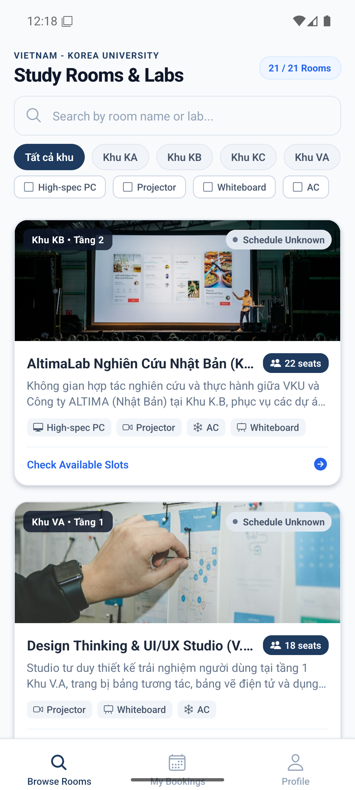
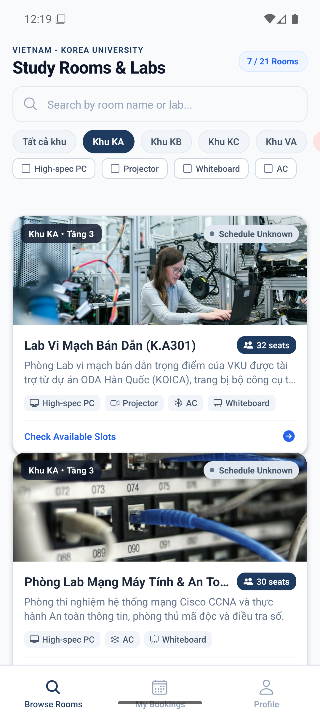
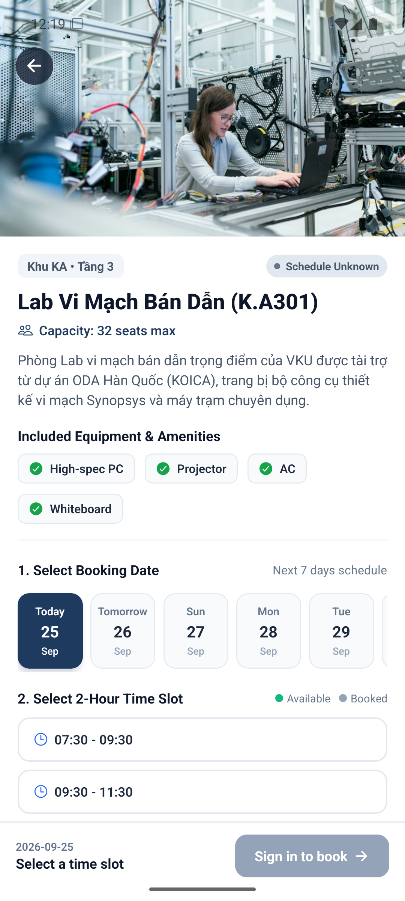
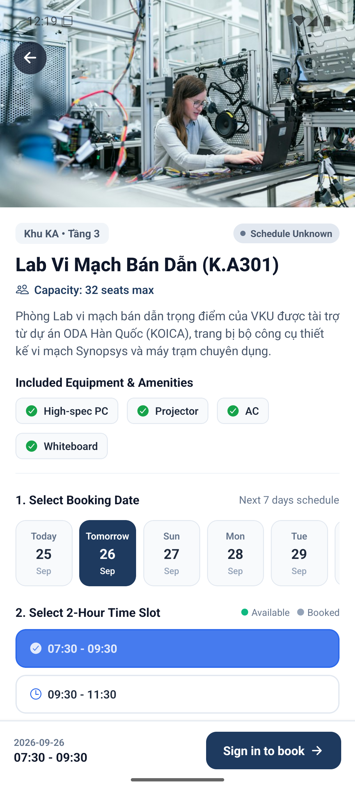
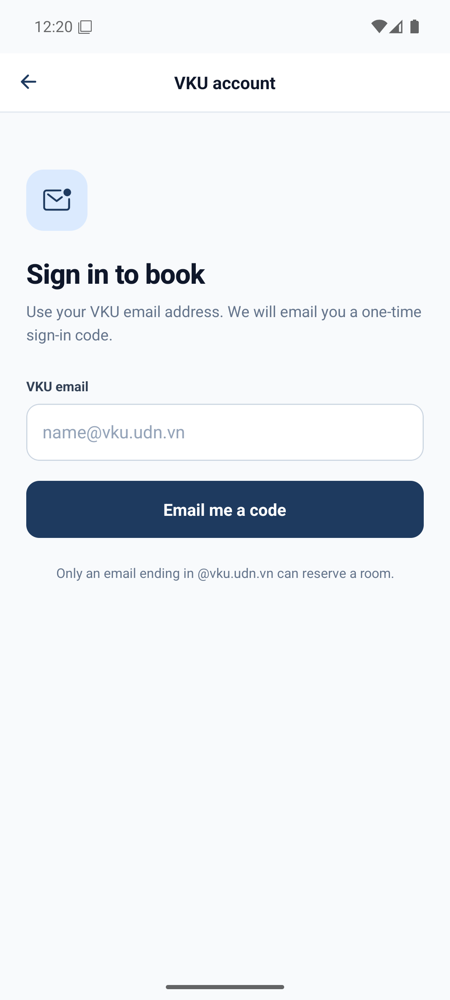

# MINI-PROJECT SHORT TECHNICAL REPORT
**Course:** Cross-Platform Mobile App Development (VKU)  
**Mini-Project Title:** Mini-Project 2 — Real-time Study Room Booking App (React Native & Expo)  
**Institution:** Faculty of Computer Science, Vietnam - Korea University of Information and Communication Technology (VKU)  
**Instructor:** Nguyen Thanh Tuan, PhD  
**Submission Date:** 25/09/2026

---

## 1. GENERAL INFORMATION & DELIVERABLE LINKS
* **Student Information (Individual Project):**
  * **Full Name:** **Dương Bảo Đạt**
  * **Student ID:** **23IT046**
  * **Class / Cohort:** **23SE1**
  * **Major:** **Information Technology (Công nghệ thông tin)**
  * **Role:** **Full-Stack Mobile Developer (Architecture, UI/UX Design, Realtime Booking & Notifications)**
  * **Contribution:** **100%**
* **🔗 Live Demo URL:** [https://vku-study-room-booking.pages.dev](https://vku-study-room-booking.pages.dev) *(Hosted on Cloudflare Pages)*
* **💻 GitHub Repository:** [https://github.com/duongdatdev/vku-study-room-booking](https://github.com/duongdatdev/vku-study-room-booking)
* **Android APK:** [GitHub Release v1.0.0](https://github.com/duongdatdev/vku-study-room-booking/releases/tag/v1.0.0) (direct-install preview build)

---

## 2. FEATURE IMPLEMENTATION CHECKLIST

| # | Feature | Status | Current implementation |
|:---:|---|:---:|---|
| 1 | Room discovery and filters | Implemented | Room data is loaded from Supabase when configured; bundled sample rooms are used when the backend is not configured or the rooms table is absent/empty. Search and filters run in the app. |
| 2 | Responsive room list | Implemented | FlatList uses memoized room cards and bounded render windows. These settings are implementation choices; no measured 60fps result is claimed here. |
| 3 | Time-slot booking | Implemented | The picker shows seven campus-local dates and discrete slots. Live occupancy comes from the sanitized room_occupancy table. A partial unique index and database trigger enforce one active booking per room/date/slot. |
| 4 | VKU email sign-in | Implemented | Supabase email OTP accepts addresses ending in @vku.udn.vn. Supabase Auth persists the session; row-level security scopes reservation reads and writes to the signed-in user. |
| 5 | Booking pass and status | Implemented | The pass is shown only after the server returns the inserted booking. Its QR payload identifies that booking. Check-in and cancellation update server state; check-in does not control a physical door lock. |
| 6 | Cross-device reservations | Implemented | The app fetches the signed-in account's bookings through row-level security and listens for permitted Realtime changes. Zustand keeps the current in-memory view and filters, not the authoritative booking record. |
| 7 | Local reminders | Implemented | A local reminder is scheduled after a booking is confirmed by the server. It is skipped when the reminder time has passed and is cancelled locally after a successful server cancellation. |
| 8 | Offline and setup behavior | Implemented | Browsing can use sample room data, but booking, cancellation, check-in, and shared availability require a configured, reachable Supabase backend. Setup is documented in README.md and supabase/schema.sql. |

The legacy rooms.is_available_now seed value is not used as live occupancy. Badges use the shared room_occupancy feed during a defined slot and show an unknown state between slots.

**Verification boundary (25 September 2026):** The installed Android build displayed 21 rooms, filtered Khu KA to 7 rooms, and opened the seven-day slot picker. The Supabase REST endpoints for `rooms` and `room_occupancy` returned HTTP 200. Email OTP delivery returned `Error sending confirmation email`, so an authenticated reservation, cross-device update, QR pass, cancellation, and reminder delivery have not yet been demonstrated end to end. Those items are implemented in code but remain pending live verification after SMTP is configured.

---

## 3. TECHNICAL ARCHITECTURE

### 3.1 Main Project Structure

- App.tsx and src/navigation/RootNavigator.tsx: application providers and authenticated navigation.
- src/providers/AuthProvider.tsx: Supabase session, VKU email validation, and email OTP flow.
- src/providers/BookingSyncProvider.tsx: owner-scoped booking refreshes, sanitized occupancy refreshes, and Realtime subscriptions.
- src/services/supabase.ts: configured Supabase client and platform-specific session storage.
- src/services/bookings.ts: server-authoritative create, cancel, check-in, and read operations.
- src/services/rooms.ts and src/hooks/useRooms.ts: room catalog query with sample-data fallback.
- src/store/useBookingStore.ts: transient filters, occupancy snapshot, and booking view state.
- src/data/timeSlots.ts and src/hooks/useCurrentCampusSlot.ts: seven-day picker and Asia/Ho_Chi_Minh campus time.
- src/screens/SignInScreen.tsx: email OTP entry and verification.
- src/screens/RoomDetailScreen.tsx and src/screens/MyBookingsScreen.tsx: booking and reservation flows.
- src/components/BookingPassModal.tsx: QR pass and server-confirmed status actions.
- supabase/schema.sql: tables, row-level security, booking constraints, triggers, and safe occupancy projection.

### 3.2 Booking and Synchronization Flow

The application treats Supabase as the source of truth for reservations. The client checks the displayed occupancy for usability, then submits a booking request. A database trigger validates the authenticated VKU email and date window; the partial unique index resolves simultaneous attempts for the same active slot. The client reads the inserted row back through the user's row-level security policy before showing the pass or scheduling a reminder.

Cancellation and check-in are also server mutations. The UI updates only after the server confirms the change. The occupancy projection contains room, date, and slot identifiers only, so Realtime subscribers do not receive student details. Each signed-in user loads their own booking rows through row-level security, allowing the same account to see its reservations on another device.

All booking dates use the Asia/Ho_Chi_Minh campus calendar, including the seven-day picker and database date-window check. Local device time zones do not change the accepted campus booking dates.

---

## 4. SCREENSHOTS AND OBSERVATIONS

The images below were captured on **VKU_Study_Room_API_36**, a Pixel 6 Android API 36 emulator whose AVD is stored at `D:\Android\avd`. The app was installed from a locally assembled native release APK using the configured Supabase project. These are actual device captures, not mockups. The neutral `Schedule Unknown` badge in these captures is expected between defined campus time slots; it does not assert that every room is free or occupied.

| Room discovery (21 rooms) | Building filter (7 of 21) |
|---|---|
|  |  |

| Room detail and seven-day selector | Selected 2-hour slot | VKU email sign-in |
|---|---|---|
|  |  |  |

The OTP send attempt failed at Supabase email delivery. No QR-pass, conflict, second-device, or notification screenshot is included because those flows were not completed on this backend. No measured 60fps result or physical door-unlock behavior is claimed.

---

## 5. TECHNICAL CHALLENGES AND RESOLUTIONS

### Challenge 1: Concurrent reservations

Several clients can select a slot while it appears available. The displayed occupancy is only a current snapshot, so it cannot prevent a race by itself. The database partial unique index is the final authority; a losing insert is rejected and the client reports the conflict.

### Challenge 2: Keeping personal booking data private

A shared real-time schedule should not expose the student attached to each reservation. Row-level security limits booking reads and mutations to the owner, while the separate room_occupancy projection publishes only room/date/slot keys. Client refreshes also discard responses that belong to a signed-out or changed account.

### Challenge 3: Consistent campus dates across time zones

The device's local date can differ from the campus date near midnight. The date picker and database validation now both use Asia/Ho_Chi_Minh, giving the same seven-day window on different devices.

### Backend setup notes

Create the Supabase project, apply supabase/schema.sql, configure the email OTP template to send the six-digit token, and set EXPO_PUBLIC_SUPABASE_URL plus EXPO_PUBLIC_SUPABASE_PUBLISHABLE_KEY in the local environment. See README.md for the full setup and deployment notes.
