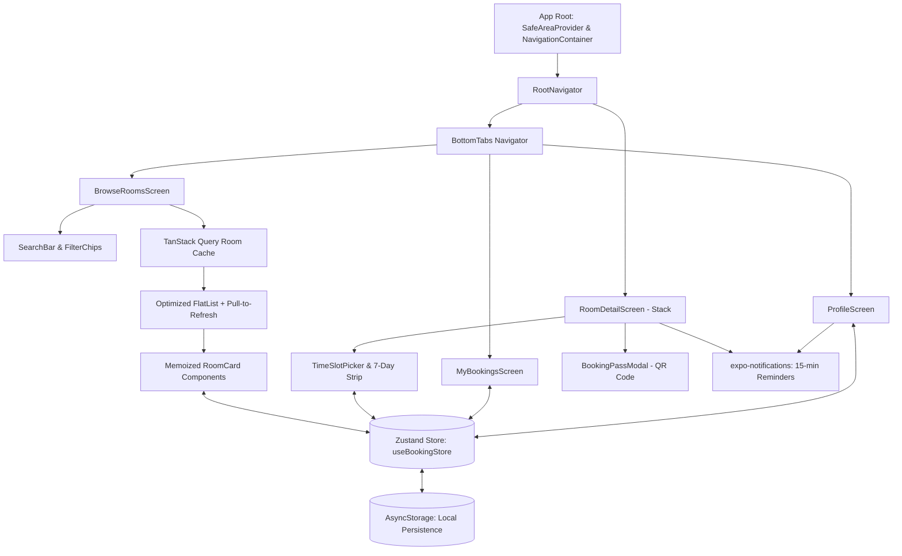

# 🏛️ VKU Real-Time Study Room & Lab Booking App

[](https://reactnative.dev/)
[](https://expo.dev/)
[](https://www.typescriptlang.org/)
[](https://zustand-demo.pmnd.rs/)

A high-performance cross-platform mobile reservation app developed for **Vietnam - Korea University of Information and Communication Technology (VKU)** students and study groups. Built in accordance with **Week 5 Lecture Architecture: Core Architecture & Components**.

---

## 🎯 Problem Scenario & Objectives
VKU students require a fast, reliable mobile app to check real-time availability and reserve campus computer labs and study rooms across buildings **KA, KB, KC, and VA** without manual room checks or double-booking collisions.

### Key Functional Specifications:
1. **Room Discovery & Multi-Parameter Filter**:
   - High-performance FlatList feed displaying 20+ rooms with photos, building/floor, capacity badges, and real-time status (*Available Now* vs *Occupied*).
   - Instant search and multi-parameter filter chips by building (`KA`, `KB`, `KC`, `VA`), capacity (2–45+ seats), and equipment (`High-spec PC`, `Projector`, `Whiteboard`, `AC`).
2. **Interactive Time-Slot Selector & Conflict Engine**:
   - 7-day date selector with 2-hour discrete time slots (`07:30–09:30`, `09:30–11:30`, `13:00–15:00`, `15:00–17:00`, `17:30–19:30`).
   - **Visual Conflict Prevention**: Slots already reserved by other students are locked, grayed-out, and disabled in real time.
3. **Interactive QR Check-In Modal & Boarding Pass**:
   - Generates a unique booking pass with an interactive QR check-in code (`react-native-qrcode-svg`).
   - One-tap "Check In at Door" mechanism with live state transitions.
4. **State Management & Cached Room Data**:
   - Dedicated `useBookingStore` managing user profile session, active reservations, collision checks, and cancellations.
   - Local storage persistence via `@react-native-async-storage/async-storage`.
   - TanStack Query caches the room feed for five minutes and powers pull-to-refresh. The current query service returns local mock data, with one API boundary ready for a real backend.
5. **Local Notifications**:
   - Integrates `expo-notifications` to trigger a reminder alert 15 minutes before the booked slot starts, with an instant test trigger on the Profile screen.
6. **Responsive Layout (Slide 26 & 27)**:
   - Custom `useResponsiveLayout` hook utilizing `useWindowDimensions()` to dynamically compute columns (`numColumns={columns}`, `key={columns}`) and card widths for phone portrait, landscape, and tablets.

---

## 🏗️ Architecture & Lecture Concepts (Week 5)



### New Architecture Compliance (Slide 6 & 7):
- **Hermes Bytecode Engine**: Sub-second cold boot and 30% lower memory footprint.
- **Fabric UI Renderer**: Synchronous UI layout without visual bridge stutter.
- **JSI (JavaScript Interface)**: Direct C++ memory invocations avoiding legacy JSON serialization bottlenecks.
- **StyleSheet & Flexbox**: `StyleSheet.create()` density-independent layouts (Slide 15, 21, 23).
- **Safe Area Insets**: Edge handling with `react-native-safe-area-context` (Slide 24).

---

## 📁 Project Structure

```
Mini-Project-2/
├── assets/                       # App icons, splash screens
├── src/
│   ├── types/
│   │   └── index.ts              # Strict TypeScript definitions
│   ├── data/
│   │   ├── mockRooms.ts          # 21 realistic VKU study rooms & computer labs
│   │   └── timeSlots.ts          # 2-hour discrete slots & 7-day generator
│   ├── store/
│   │   └── useBookingStore.ts    # Zustand state + AsyncStorage persistence + conflict engine
│   ├── hooks/
│   │   ├── useResponsiveLayout.ts# Slide 26-27 responsive columns & dimensions
│   │   └── useNotifications.ts   # expo-notifications 15-min reminder scheduler
│   │   └── useRooms.ts           # TanStack Query room-feed hook
│   ├── providers/
│   │   └── QueryProvider.tsx     # Shared QueryClient configuration
│   ├── services/
│   │   └── rooms.ts              # Replaceable room data API boundary
│   ├── components/
│   │   ├── RoomCard.tsx          # Memoized room card with badges (Slide 14, 15)
│   │   ├── SearchBar.tsx         # Controlled search input (Slide 18)
│   │   ├── FilterChips.tsx       # Building, capacity & equipment chips
│   │   ├── TimeSlotPicker.tsx    # 7-day strip + 2h slot conflict selector
│   │   ├── BookingPassModal.tsx  # Boarding pass with QR Code & check-in
│   │   └── StatusBadge.tsx       # Real-time Available vs Occupied badge
│   ├── screens/
│   │   ├── BrowseRoomsScreen.tsx # 60fps FlatList room discovery (Slide 17, 29)
│   │   ├── RoomDetailScreen.tsx  # Reservation flow with conflict prevention
│   │   ├── MyBookingsScreen.tsx  # Manage reservations, status & QR passes
│   │   └── ProfileScreen.tsx     # VKU Student ID card, metrics, notif test
│   └── navigation/
│       └── RootNavigator.tsx     # React Navigation 7 Tabs + Native Stack
├── app.json                      # VKU Expo configuration (Slide 11)
├── App.tsx                       # Root container (Slide 24)
├── Mini-Project-2-Report-Template.md # Technical report ready for PDF export
└── package.json
```

---

## 🚀 Quick Start Guide

### Prerequisites
- Node.js (v18 or higher)
- npm or yarn
- Expo Go app on your physical iOS/Android phone (Optional)

### Installation
```bash
# 1. Clone repository
git clone https://github.com/your-repo/vku-room-booking.git
cd vku-room-booking

# 2. Install dependencies
npm install
```

### Running the App
```bash
# Start Expo development server
npx expo start

# Run on Android Emulator
npx expo start --android

# Run on iOS Simulator (macOS)
npx expo start --ios

# Run on Web Browser
npx expo start --web
```

- **Physical Device**: Open the **Expo Go** app on your phone and scan the terminal QR code.

---

## 🧪 Testing Features Checklist
1. **Search & Filter**:
   - Type in `Lab` or `KA201` in the search bar.
   - Tap `Khu KA`, `Khu KB`, `Khu KC`, or `Khu VA` chips to isolate campus zones.
   - Select `High-spec PC` or `Projector` to filter rooms by equipment.
2. **Conflict Prevention Demonstration**:
   - Tap `Lab Vi Mạch Bán Dẫn (K.A301)`.
   - On **Today**, slots `07:30 - 09:30` and `13:00 - 15:00` are already booked (marked with red badge and locked).
   - Pick an available slot (e.g., `09:30 - 11:30`) and tap **Confirm Booking**.
   - The booking pass immediately opens with the generated QR code.
   - Returning to the room shows `09:30 - 11:30` is now disabled for subsequent reservations!
3. **QR Check-in & Cancellation**:
   - Go to **My Bookings** tab.
   - Tap **View QR Check-In Pass**, then click **Check In at Door**.
   - Observe the live status transition from `CONFIRMED` to `CHECKED IN`.
4. **Local Notifications**:
   - Switch to **Profile** tab and tap **Test 15-min Local Notification** to test instant device alerts.
5. **Room Refresh & Motion**:
   - Pull down on the Browse Rooms list. The refresh indicator confirms that the TanStack Query room feed is being refetched.
   - Clear a filter or refresh the list to see a short, staggered Room Card entry animation; device reduced-motion settings are respected.

## Data source note

The room feed intentionally uses `src/data/mockRooms.ts` behind `src/services/rooms.ts`. This meets the coursework requirement for TanStack Query and pull-to-refresh while no campus API has been supplied. Replace only `fetchRooms` when a real service becomes available; the screen, cache behavior, and refresh interaction remain unchanged.
